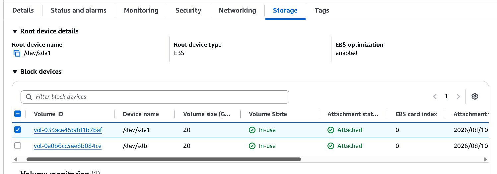
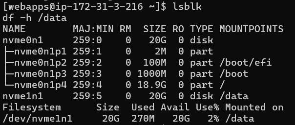
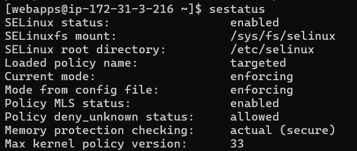
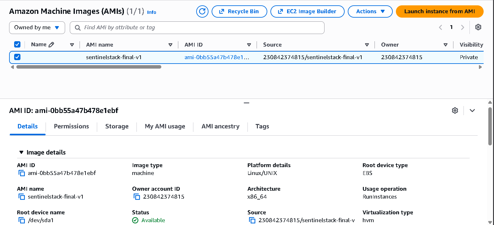
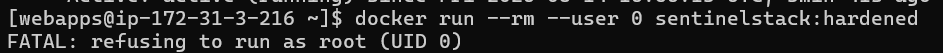
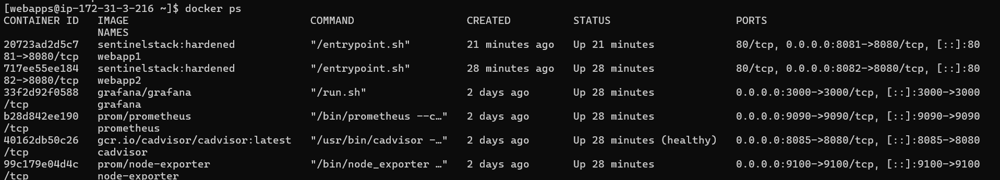
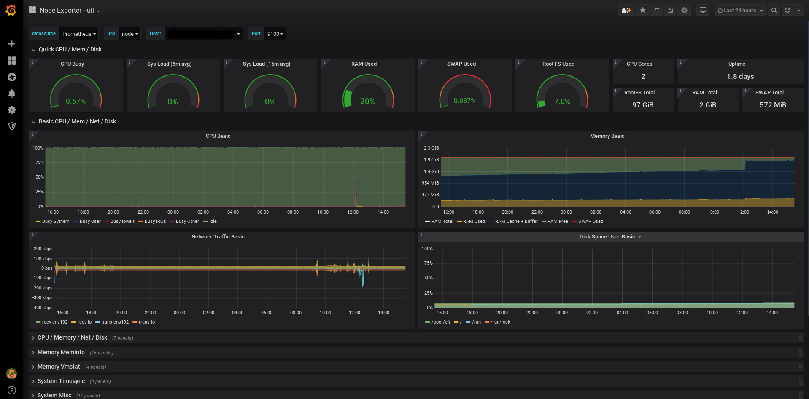
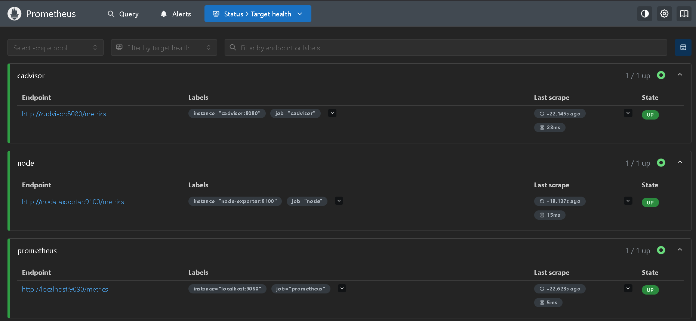
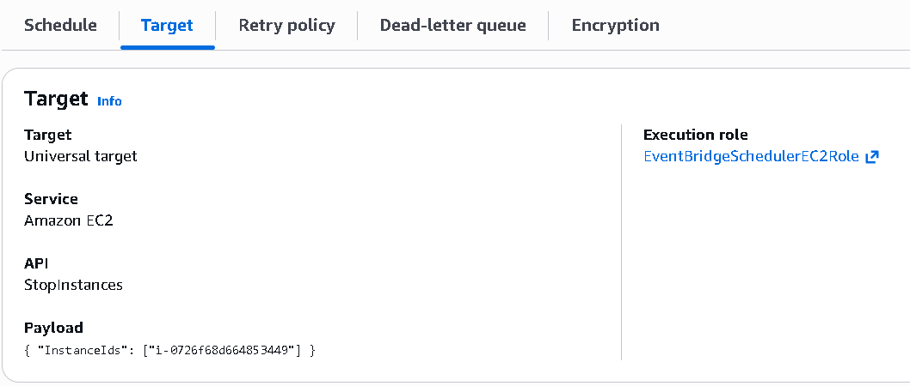

# SentinelStack

SentinelStack (working name Wellspring) is a small habit-tracking app I built in PHP; water,
mood, sleep, movement, mindfulness, daily intentions, one account, one SQLite file. This
README covers both the app and how I deployed it: EC2, rootless Docker, SELinux enforcing,
systemd-managed failover, and a Prometheus/Grafana monitoring stack, all under a single
non-root service account.

## Why deploy it this way

I could run this with `php -S` on my laptop and be done in five minutes. The deployment side
of this project was a deliberate exercise, separate from the app itself: take something
small and actually working, and put it through a production-style setup; rootless
containers, mandatory access control, failover, real monitoring; the kind of infrastructure
work that shows up in job requirements far more than it shows up in tutorials.

## What's running, and how each requirement was met

| Requirement | What I did |
|---|---|
| EC2 instance, OS disk + data disk | Rocky Linux 9, 20GB root volume, separate 20GB volume mounted at `/data`.   |
| Rootless Docker | Docker daemon runs under a dedicated non-root user; no root-owned daemon anywhere on the host |
| User namespaces enabled | Confirmed via `/proc/sys/user/max_user_namespaces`, subordinate UID/GID ranges set in `/etc/subuid` and `/etc/subgid` |
| Docker starts on boot | `systemd --user` service + `loginctl enable-linger`; I stopped and restarted the whole instance to actually confirm this, not just assumed it |
| SELinux enforcing | Rocky Linux ships this on by default ; checked with `sestatus` after launch.  |
| Immutable AMI | Created after full configuration, via EC2 → Create image.  |
| Service user, UID 10000–12000 | `webapps`, UID 10500 |
| Web app on `php:8.5-apache` | Custom image, see `deploy/Dockerfile` |
| Container can't run as root | Two layers: `USER appuser` in the Dockerfile, plus a runtime check in the entrypoint that exits if UID is 0. Tested with `docker run --user 0` ; it refuses, as required.  |
| No privileges, all dropped | `--cap-drop=ALL` on every app container |
| No privilege escalation | `--security-opt no-new-privileges`.  |
| systemd wrapper, boot-enabled | `deploy/systemd/webapp1.service`, `webapp2.service`.  |
| Container data on the data disk | Bind-mounted from `/data/webapps/...` |
| Multiple containers, failover | Two identical containers on separate ports, each its own systemd unit with `Restart=always`.  |
| Grafana, rootless, same user | Runs under `webapps`, same as everything else.  |
| Prometheus, rootless, host + container metrics | `deploy/prometheus/prometheus.yml` ; scrapes node-exporter and cAdvisor.  |
| Shutdown schedule | EventBridge Scheduler, nightly, IAM role scoped to `ec2:StopInstances` only.   |

## The parts that didn't work first try

I'm including this because I think it's more useful than pretending everything went smoothly.

Rootless Docker isn't what the name suggests at first glance. It doesn't mean the container
avoids root, it means the Docker daemon itself runs as an ordinary user instead of root, so
there's no root-owned background process to attack in the first place. Making the container
also refuse to run as root was a separate requirement on top of that. Rather than committing
a separate `entrypoint.sh` file, the check is generated directly inside the Dockerfile with a
single `RUN` instruction that writes the script into the image at build time, it checks its
own UID as soon as the container starts, and exits immediately if that UID is 0.

The trickiest bug wasn't in the app, it was in my own shell command. Early on I ran two `sed`
substitutions back to back to change Apache's listen port, and the second one ran again on
the line the first had already fixed, mangling it into an invalid port number. Apache's error
pointed at the config file, not at the cause, which was the command that generated it. Fixed
by anchoring the substitution so it could only match the exact original line, once.

Prometheus and Grafana both kept crashing with permission errors on their data folders, even
after I'd set ownership to match the UID each container reported running as. Turned out that
UID gets remapped by the kernel under rootless Docker's user namespaces, the number a
container sees isn't the number that actually owns files on the host. Once I understood that,
the fix was straightforward.

And `host.docker.internal`, which is the usual way to let a container reach something running
on the host, doesn't reliably reach *other containers'* ports under rootless Docker, it goes
through a different network path than it does in a normal root-owned Docker setup. The fix
was putting Prometheus, node-exporter, and cAdvisor on a shared Docker network and having them
talk to each other by container name instead of going through the host at all.

## Monitoring, and why there's only one config file for it

Grafana is configured entirely through its own web UI, add a data source, import a
dashboard. There's no file for it in this repo; its settings live in Grafana's own internal
database, which is why its data directory is on the persistent data disk.

Prometheus is the one place with a hand-written config, `deploy/prometheus/prometheus.yml`.
It needs one because it's pull-based and doesn't know anything about your infrastructure by
default, you tell it explicitly what addresses to poll and how often. Something like AWS
CloudWatch doesn't need that because it's push-based and built into AWS itself, EC2 sends it
metrics automatically since they're the same company's products. Prometheus works the same
way regardless of what it's monitoring or where, which is the whole reason it's used outside
AWS-only environments in the first place.

## Repository layout

```
sentinelstack/
├── deploy/
│   ├── Dockerfile              the actual image build for the PHP app
│   ├── systemd/
│   │   ├── webapp1.service
│   │   └── webapp2.service
│   └── prometheus/
│       └── prometheus.yml
├── public/                     web root
├── src/                        App / Models / Controllers
├── templates/                  view layer
├── config/routines.php
├── database/                   schema.sql, seed.php
├── bin/                        cron.php and local dev helpers
├── composer.json / composer.lock
└── .env.example
```

## Reproducing the deployment

```
docker build -t sentinelstack:hardened -f deploy/Dockerfile .
```

Copy `deploy/systemd/*.service` into `~/.config/systemd/user/` on the target host:

```
systemctl --user daemon-reload
systemctl --user enable --now webapp1.service webapp2.service
```

For the monitoring side: run node-exporter and cAdvisor as plain containers, put them on a
shared Docker network with Prometheus, then point `deploy/prometheus/prometheus.yml` at them
by container name. Add Grafana on the same network and point its data source at
`http://prometheus:9090` through the Grafana UI.

## Application

### Features

Hydration logging with 7-day and 30-day charts. Daily intentions and recurring habits.
A guided mindfulness timer with three breath patterns. Mood and gratitude, one entry a day.
Eight movement routines. Sleep logging. A stats page with a plain-English weekly review.
Settings for theme, water goal, password, and account deletion.

### Running it locally, without Docker

Requires PHP 8.0+ with `pdo_sqlite`, `mbstring`, `json`, plus Composer.

```
composer install
cp .env.example .env
php database/seed.php
php -S 127.0.0.1:8000 -t public public/index.php
```

Open `http://127.0.0.1:8000` — first page is `/login`.

### Security

Passwords hashed with Argon2id. CSRF token required on every request that changes data,
rotating on a timer. Sessions are `HttpOnly` and `SameSite=Lax`, with the session ID
regenerated on login so a cookie stolen before sign-in is useless afterward. Login is
rate-limited per email, registration rate-limited per IP. All database queries go through
PDO prepared statements.

### License

MIT.
